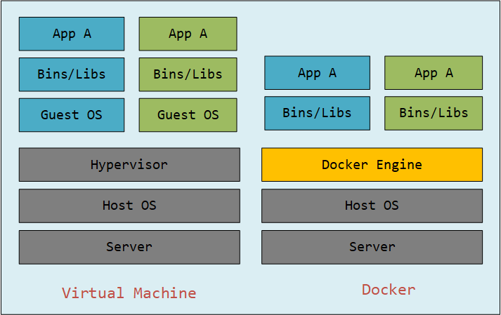

# Docker

## 一、Docker介绍

### 1.1 Why Docker

Docker之前，部署应用失败的主要原因为环境问题，也导致了开发与运维之间的诸多争执，Docker的出现，打破了“代码即应用的观念”，它从系统环境开始，自底向上打包应用，使应用达到跨平台批量部署的目的。

### 1.2 What's Docker

Docker使基于Go语言实现的云开源项目，其主要目标使“Build, Ship and Run Any App, Anywhere”，也就是通过对应用组件的封装、分发、部署、运行等生命周期的管理，使用户App及其运行环境能够做到“一次封装，到处运行”。

总结起来就是，Docker是解决了运行环境和配置问题的软件容器，是一种方便做持续继承并有助于整体发布的容器虚拟化技术。

### 1.3 虚拟机 VS 容器化技术

虚拟机实现资源隔离的方法是利用独立的OS，并利用Hypervisor虚拟化CPU、内存、IO设备等。

容器环境并不使用一个完全独立的Guest OS实现环境隔离，而是直接将容器层比如（LXC或者libcontainer)安装到宿主机操作系统之上，每个容器化应用都会共享相同的操作系统。

通过对虚拟机和容器化技术实现原理的比较，可以得出如下结论：

> （1）容器有着比虚拟机更少的抽象层。由于容器不需要Hypervisor实现硬件资源虚拟化，运行在容器上的应用直接使用的都是实际物理机的硬件资源，因此在CPU、内存利用率上容器会有效率优势。
>
> （2）容器利用的是宿主机的内核，不需要Guest OS，因此，当启动一个虚拟机时，需要重新加载一个操作系统内核，会耗费大量的时间和资源，而容器更加轻量化，启动速度极快，只需要几秒钟。同时，因为现代操作系统的复杂性，容器相比于虚拟机在资源消耗上也占有较大优势，在一台物理机上我们可以建立成百上千的容器，但是只能建立几个虚拟机。

### 1.4 Docker的使用场景

Docker通常用于如下场景：

- Web应用的自动化打包和发布；
- 自动化测试和持续集成、发布；
- 在服务型环境中部署和调整额数据库或其他的后台应用
- 从头编译或者扩展现有的OpenShift或CloudFoundry后台来搭建自己的Pass环境

### 1.5 Docker三要素

- ##### 镜像

    Docker（镜像Image）是一个只读的模板，镜像可以用来创建Docker容器，一个镜像可以创建多个容器，就像一个类可以用来实例化多个对象。

- ##### 容器

    Docker利用容器（Container）独立运行一个或一组应用容器是用镜像创建的运行实例，它可以被启动、开始、停止、删除。每个容器时相互隔离的、保证平台的安全。可以把容器看作是一个简易版的Linux环境（包括root用户权限、进程空间、用户空间和网络空间等）和运行在其中的应用环境。

- ##### 仓库

    仓库（Repository）是集中存放镜像文件的场所。仓库（Repository）和仓库注册服务器（Registry）是有区别的，仓库注册服务器上往往存放着多个仓库，每个仓库中又包含了多个镜像，每个镜像有不同的标签（tag）。

    仓库分为公开仓库（Public）和私有仓库（Private），最大的公开仓库 [Docker Hub](https://hub.docker.com/)。

### 1.6 总结

Docker本身是一个容器运行载体或称之为管理引擎。我们把应用程序和配置依赖打包形成一个可交付的运行环境，这个打包好的运行环境就是Image镜像文件。只有通过这个镜像文件才能生成Docker容器。Image文件可以看作是容器的模板模板。Docker根据Image文件生成容器实例，同一个Image文件，可以生成多个同时运行的容器实例。

## 二、Docker安装

